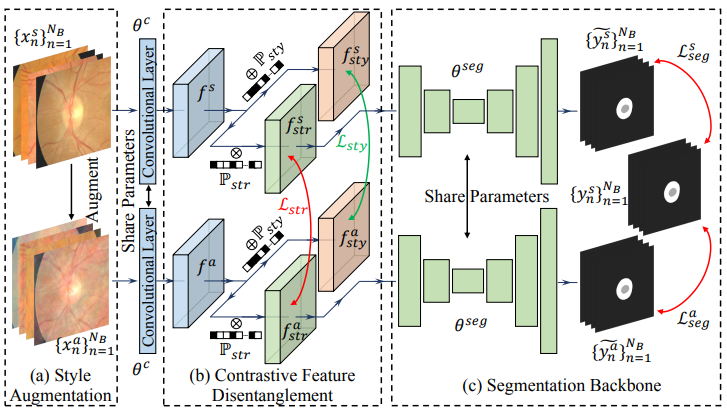

# 📄 Devil is in Channels: Contrastive Single Domain Generalization for Medical Image Segmentation ($C^2SDG$) 

#### [Paper](https://arxiv.org/abs/2306.05254)

<p align="center"></p>

### Data Preparation

We use the public available [RIGA+](https://zenodo.org/record/6325549) dataset for our experiments.
You should download the dataset and unzip it.

### Dependency Preparation

```shell
cd CCSDG
# Python Preparation
virtualenv .env --python=3
source .env/bin/activate
# Install PyTorch, compiling PyTorch on your own workstation is suggested but not needed.
# Follow the instructions on https://pytorch.org/get-started/locally/
pip install torch torchvision torchaudio # or other command to match your CUDA version
# Install CCSDG
pip install -e .
```

### Model Training and Inference

```shell
# Path Preparation
export OUTPUT_FOLDER="YOUR OUTPUT FOLDER"
export RIGAPLUS_DATASET_FOLDER="RIGA+ DATASET FOLDER"

# BinRushed as source domain
ccsdg_train --model unet_ccsdg --gpu 0 --tag source_BinRushed \
--log_folder $OUTPUT_FOLDER \
--batch_size 8 \
--initial_lr 0.01 \
-r $RIGAPLUS_DATASET_FOLDER \
--tr_csv $RIGAPLUS_DATASET_FOLDER/BinRushed.csv \
--ts_csv $RIGAPLUS_DATASET_FOLDER/MESSIDOR_Base1.csv \
$RIGAPLUS_DATASET_FOLDER/MESSIDOR_Base2.csv \
$RIGAPLUS_DATASET_FOLDER/MESSIDOR_Base3.csv

# Magrabia as source domain
ccsdg_train --model unet_ccsdg --gpu 0 --tag source_Magrabia \
--log_folder $OUTPUT_FOLDER \
--batch_size 8 \
--initial_lr 0.01 \
-r $RIGAPLUS_DATASET_FOLDER \
--tr_csv $RIGAPLUS_DATASET_FOLDER/Magrabia.csv \
--ts_csv $RIGAPLUS_DATASET_FOLDER/MESSIDOR_Base1.csv \
$RIGAPLUS_DATASET_FOLDER/MESSIDOR_Base2.csv \
$RIGAPLUS_DATASET_FOLDER/MESSIDOR_Base3.csv
```

### Citation ✏️ 📄

If you find this repo useful for your research, please consider citing the paper as follows:

```
@inproceedings{hu2023devil,
  title={Devil is in Channels: Contrastive Single Domain Generalization for Medical Image Segmentation},
  author={Shishuai Hu and Zehui Liao and Yong Xia},
  booktitle={International Conference on Medical Image Computing and Computer-Assisted Intervention},
  year={2023},
  organization={Springer}
}
```